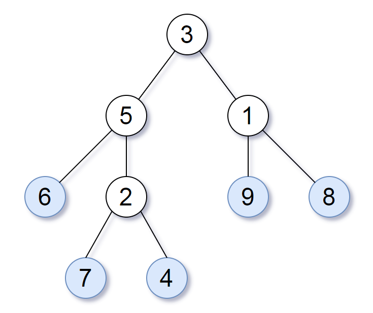

## Problem Statement:
Consider all the leaves of a binary tree. From left to right order, the values of those leaves form a leaf value sequence.


For example, in the given tree above, the leaf value sequence is (6, 7, 4, 9, 8).

Two binary trees are considered leaf-similar if their leaf value sequence is the same.

Return true if and only if the two given trees with head nodes root1 and root2 are leaf-similar.

## Solution Description:
This problem is a variation of a depth first search problem. In this implementation of DFS, we need to build out our list of leaf nodes for each root node and then compare these lists to see if they are equivalent. The code implementation of this is below (language used is Python).

```python
def leafSimilar(root1, root2):
        def dfs(node):
            if node:
                if not node.left and not node.right:
                    yield node.val
                yield from dfs(node.left)
                yield from dfs(node.right)

        return list(dfs(root1)) == list(dfs(root2))
```

Above we have the implementation, now let's walk through it to look under the hood a little. We will skip over the def lines and jump straight into the good parts.

```python
 if not node.left and not node.right:
     yield node.val
```
This chunk is our base case test: if there is a value in either node.left or node.right, this node is not a leaf. If there are no values in either node.left or node.right, we yield the value of the node. Note the use of yield here instead of return, this allows us to pass a value while still maintaining state.

```python
yield from dfs(node.left)
yield from dfs(node.right)
```

This chunk is the heart of our recursive call. The first line passes the left child of the node into our depth first search function while the second line passes the right child. 

```python
  return list(dfs(root1)) == list(dfs(root2))
```
This is the final line, where we call our dfs function with our two root values. Wrapping the dfs function in the list method allows us to build out a list of all the leaf nodes that are yielded from our function (the main reason we used yield instead of return in our function). Once both lists have been built, we check if they are equivalent, finally returning True or False based on that check.